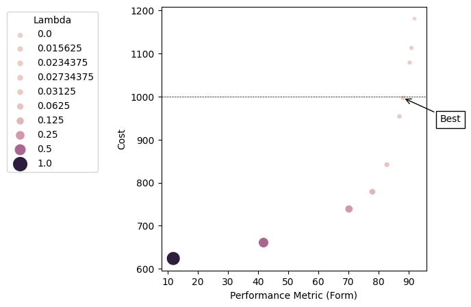

# Linear Program for Optimal FPL Player Selection

## Theory

### Problem Description
[Fantasy Premier Leauge](https://fantasy.premierleague.com/) is a competition where participants can pick a team of 15 players from the Premier League under a set of specific constraints. The competition proceeds in rounds and each of the players is awarded points based on how well he played in every round. The goal is to get as many points as possible and the constraints under which players can be selected are:
- Every player can only be selected once.
- There can be at most three players from the same team.
- The selection must contain exactly two goalkeepers, five defenders, five midfielders, and three forwards.
- The combined cost of the selection must not exceed a given budget.


A natural question that arises is: 

**Given a performance score for each player, what are the optimal picks under the given constraints?**

**Brute-Force:** The above question could easily be answered by iterating over all possible teams. However, in the Season 2020/2021, there are 68 goalkeepers, 219 defenders, 240 midfielders, and 76 forwards to pick from. Ignoring the constraints limiting the number of players from the same team, the number of possible picks is roughly 4 * 10<sup>27</sup>. Hence, even with the additional constraint, iterating over all teams is likely unfeasible.

**Knapsack:** Anyone who has had at least one algorithm class in his life probably knows about the knapsack problem and how to solve it in pseudo-polynomial time. Unfortunately, the complexity of the pseudo-polynomial time algorithm grows exponentially in the number of constraints and therefore the above problem cannot be efficiently solved (note that allowing at most three players from the same team introduces 20 constraints).

### Linear Program Formulation
The above problem can be formulated as an integer linear program. Let *p<sub>i</sub>* be the performance score, *team<sub>i</sub>* be the team, *pos<sub>i</sub>* be the position, and *c<sub>i</sub>* be the cost of player *i*. Then the linear program formulation reads:


Where *x<sub>i</sub>* indicates whether player *i* is selected or not. Unfortunately, solving integer linear programs is NP-hard and if the linear program is solved with standard solvers, there is no guarantee for a meaningful result. For example, *x<sub>i</sub>* and *x<sub>j</sub>* could both be 0.5 for *i* not equal to *j* and it's not possible to add half a player to a team.

To get around this limitation, a Lagrangian relaxation can be applied in order to remove the *hard* budget constraint and instead punish expensive solutions by manipulating the cost function. The relaxed linear program is given by


where *lambda* is a non-negative constant. It can be shown that the optimal solutions are integral which means all *x<sub>i</sub>* are either *0* or *1*.*

### Proof that Solutions are Integral
Every linear program can be written in terms of a constraint matrix *A* and a coefficient vector *b* (see [Wikipedia](https://en.wikipedia.org/wiki/Linear_programming) for an example). It has been shown that when *A* is TU (totally unimodular) and *b* is integral, then the corresponding linear program has integral optima. It is obvious that in the present case, *b* is integral. Therefore, what's left to show is that *A* is TU.

> Note: A TU matrix is a matrix for which every square non-singular submatrix has a determinant *0*, *+1*, or *-1*. Therefore, it can only have entries 
which are *0*, *+1*, or *-1* which conveniently shows, why, in the constraint matrix above, the budget constraint breaks the total unimodularity.

Short proof that A is TU using the [Ghouila-Houri Theorem](https://en.wikipedia.org/wiki/Unimodular_matrix): Every constraint from the relaxed linear program formulation above contributes one row to A. It has to be shown that for every subset *R* of the rows of *A*, there is an assignment of signs to rows in *R*, such that the sum of the rows times the assigned sign has all its entries in *{-1, 0, 1}*. Distinguish the case where all rows in *R* correspond to constraints about the team of the player. In that case, since all players are part of exactly one team, the same sign can be assigned to all rows in *R* and the condition is fulfilled. Similarly, if all rows in *R* correspond to constraints about the position of the player, the same sign can be assigned to these rows as well. For the case where *R* contains rows corresponding to constraints about the team and the position of the player, simply assign *-1* to all constraints about the team and *+1* to all constraints about the position.

> Note: To be precise, every constraint about the position of the player contributes two rows to the matrix *A* because it's an equality constraint. However, this is not a problem as these rows will simply cancel out when assigned the same sign.


## Example
The player data provided in `/data` is from Gameweek 13 in the season 20/21. The form of a player (average number of points in the last 4 weeks) was chosen as the performance metric and the total budget was set to 1000. This corresponds to the initial budget a user has when starting to play Premier League fantasy football.

The plot below shows the solutions to the linear program for different values of *lambda*. As expected, the sum of the performance scores of the players improves and the cost increases when the value of *lambda* is decreased. The best feasible solution is the one with the smallest value for *lambda* which is still affordable with the given budget (indicated by the dotted line).





Below is the output of the program for the best run (*lambda=0.02734375*). The sum of the performance scores is *88.2* which means that this team would have scored an average of almost 90 points in the last four weeks.

```
> ------------------------------
> Web Name            Cost Form
> ------------------------------
> "Groß"              58   5.2
> "Pope"              54   7
> "Calvert-Lewin"     79   6.2
> "Vardy"             103  6
> "Dallas"            46   4.4
> "Alioski"           44   4.8
> "Robertson"         72   5.4
> "Mahrez"            85   6
> "Rashford"          94   6.2
> "Joelinton"         57   5
> "Bednarek"          46   5
> "Lloris"            56   6.8
> "Son"               96   8
> "Ogbonna"           49   5.8
> "Neto"              58   6.4
> ------------------------------
> Overall Cost: 997 $
> Overall Form: 88.2
```

## Installation

1. Install CGAL and create the cmake scripts:

   ```
   sudo apt-get install libcgal-dev
   cgal_create_cmake_script
   ```
2. Compile:
   ```
   cmake .
   make
   ```
3. Run with `lambda : [0, 0.5, 1]`:
   ```
   ./main 0
   ./main 0.5
   ./main 1
   ```